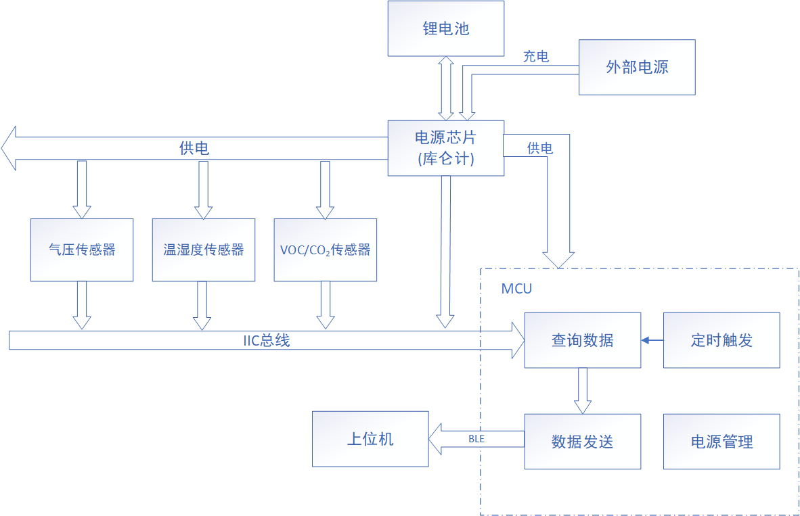
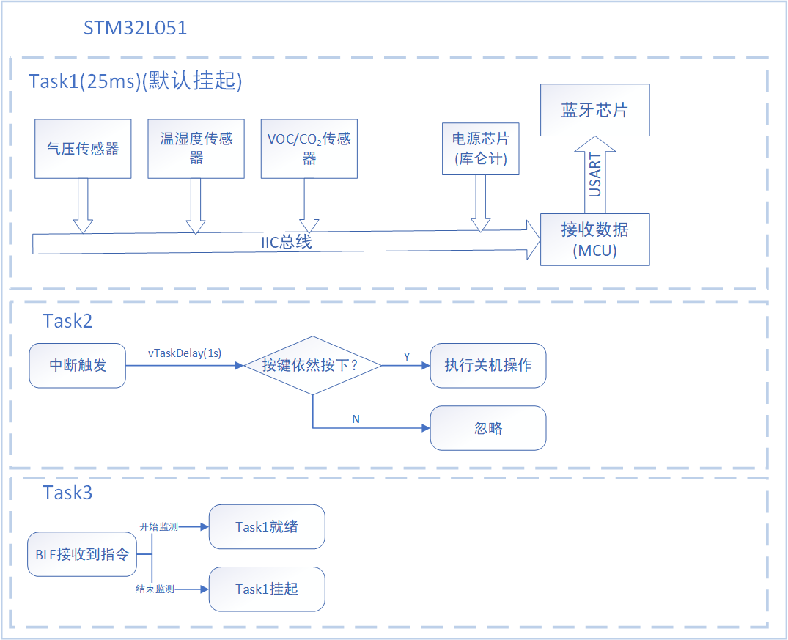
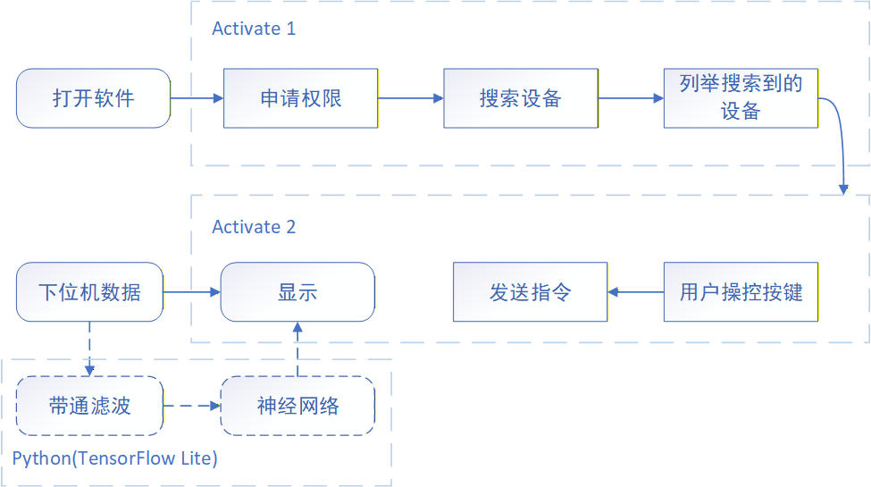

# 基于微传感器阵列的呼吸健康监测系统

<p align="center">
  <a href="https://github.com/EERNINUO/mask-health-monitor" style="margin: 2px;">
    
  </a>
  <a href="https://github.com/EERNINUO/mask-health-monitor" style="margin: 2px;">
    
  </a>                                  
  <br/>
  <a href="https://raw.githubusercontent.com/EERNINUO/mask-health-monitor/main/LICENSE" style="margin: 2px;">
    
  </a>
  <a href="https://raw.githubusercontent.com/EERNINUO/mask-health-monitor/main/LICENSE" style="margin: 2px;">
    
  </a>
    <a href="https://raw.githubusercontent.com/EERNINUO/mask-health-monitor/main/LICENSE" style="margin: 2px;">
    
  </a>
  <!-- <a href="https://github.com/EERNINUO/mask-health-monitor/releases" style="margin: 2px;">
    
  </a> -->
</p>
</div>

## 🎯 项目概述

| 模块 | 状态 | 说明 |
|------|------|------|
| 传感器阵列 + STM32L 采集固件 | ✅ 完成 | 可正常采集多路传感器数据，通过串口/CH9141 透传输出 |
| 硬件设计（STM32L+CH9141 方案） | ✅ 完成 | 含原理图、PCB、BOM，已打样验证 |
| Android 基础 BLE 接收端 | ⚠️ 部分过时 | 基于旧版 Google BLE 驱动，Android 新版需重构 |
| 多分支 CNN 呼吸模式识别模型 | ✅ 完成 | 可对传感器阵列数据进行分类 |
| 单芯片方案（CH573）硬件 | ✅ 完成 | PCB 已设计，待固件开发 |
| CH573 BLE 协议栈固件 | 🚧 开发中 | 基础透传已完成，应用逻辑待移植 |
| 文档与重构 | 📝 进行中 | 当前仓库为整理后版本，历史仓库封存 |

## ✨ 功能特性
- [x] 硬件设计（STM32L 版本含原理图/PCB，CH573 版本进行中）
- [x] 固件开发（CH9141 透传方案完整）
- [ ] 单芯片 BLE 方案（CH573）—— 固件开发中
- [x] Android 基础 BLE 通信框架（待适配新版驱动，贡献欢迎）
- [x] 基于 Python 的多分支神经网络模型

## 🏗️ 系统架构



> *本项目的核心在于传感器阵列数据、BLE 通信和 AI 模型的完整闭环。*
>*注：当前稳定链路为 STM32L + CH9141；CH573 单芯片方案可降低 BOM 成本，但 BLE 协议栈集成仍在进行中。*

## 📊 项目历史与技术演进
本项目的技术方案经历了两轮主要迭代，这里如实记录演进路径及中途遇到的挑战：
1.  **方案一 (STM32L + CH9141)**：功能完整验证了数据采集、透传和模型推理能力，但是未能实现数据波形的绘制，模型在 Android 端的部署。
2.  **方案二 (CH573 单芯片)**：为降低成本、简化设计转向单芯片集成。目前硬件已完成，但固件端 CH573 BLE 协议栈调试尚在进行中，这是本项目的**主要瓶颈**。
3.  **技术挑战**：在方案二推进期间，Android 新版 API 更新了权限模型，虽然在新版本 Android 上能进行兼容，但是在某些非原生 Android 权限模型可能与原生 Android 不同，导致旧有 Android 代码需要重构 BLE 驱动部分，目前该项目暂处于维护休眠期。

## 📁 项目结构
mask-type-health-monitoring-system/
├── README.md               
├── LICENSE  # GPL-3.0
├── docs/ # 详细文档
│   └──  LICENSE # CC BY-SA 4.0  
├── firmware/ 
│   ├── stm32l_project_v2.0/ # STM32L + CH9141 方案固件
│   └── ch573_project_v1.0/ # CH573 单芯片方案固件
├── hardware/  # 硬件设计文件
│   ├── stm32l_project/ # STM32L + CH9141 方案 PCB
│   ├── ch573_project/ # CH573 单芯片方案 PCB
│   └── LICENSE # CERN-OHL-S-2.0   
├── android/  # Android 应用源码
├── training/  # 模型训练代码
└── mechanical/  # 机械结构

## ⚠️ 已知问题与兼容性说明

### 1. 部分鸿蒙（HarmonyOS 3.0）设备兼容性问题
- **问题现象**：应用在Android 14（API 34）设备上功能正常，但在部分升级至HarmonyOS 3.0的设备上，无法扫描和连接BLE设备。系统自带的蓝牙设置页面能正常发现设备，但应用与官方调试助手均无法正常工作。

- **问题原因**：初步定位为鸿蒙系统的权限管理差异导致。部分Android应用所使用的旧版BLE API在鸿蒙3.0下运行，可能被要求申请一个不对第三方应用开放的 ohos.permission.MANAGE_BLUETOOTH 系统级权限，从而导致应用卡在权限申请阶段。

- **长期方案**：计划在新版本中增加针对鸿蒙系统的权限检测逻辑，在连接BLE设备前主动引导用户完成以上设置。
  
> 如果开发者朋友有意向接手或测试该功能，欢迎提交PR。

### 2. 没有合适的气体传感器
- **问题现象**：目前项目中尝试使用过`SGP-30`和 `SGP-40`传感器，但均无法满足项目需求。
- **问题原因**：
  - **SGP-30**工作电流约为 50mA，耗电量大的同时发热量也过大，会影响温度传感器数值；
  - `SGP-40`传感器虽然功耗发热量较小，但输出值为空气质量系数，且需要搭载官方的算法库。
  - 二者都需要一定的启动时间，无法满足实时监测的需求。
- **解决方案**：
  - **临时解决方案**：暂时舍弃气体传感器，只使用温湿度传感器和压力传感器。
  - **长期解决方案**：寻找更加合适的气体传感器，以替代现有的传感器阵列。

## 🚀 快速开始

### 1. 硬件搭建（验证过的 STM32L 方案）
- 从 `hardware/stm32l_ch9141/` 获取原理图和 PCB 文件（立创 EDA 格式）。
- 打样并焊接。**注意**：传感器阵列需按 BOM 清单选用对应型号。

### 2. 固件编译与烧录
- 使用 Keil MDK 将固件编译并烧录到 STM32L 单片机上。

### 3. Android 端使用
- 使用 Android Studio 打开 android/ 项目，编译下载。

### 4. 运行呼吸识别模型（离线）
1. 环境配置说明
  需要注意的是，机器学习开发环境的配置涉及 TensorFlow、CUDA 和 cuDNN 三者之间严格的版本对应关系，不恰当的版本组合可能导致GPU无法被识别。
  本项目的模型训练环境配置如下：
  - 操作系统: Ubuntu 24.04 (通过 WSL2 运行)
  - Python 版本: 3.12
  - TensorFlow 版本: 2.14
  - CUDA 版本: 11.8
  - cuDNN 版本: 8.6

2. 数据集
- 请将数据集按照分类放置到`health_data_folder`和`ill_data_folder`文件夹中。
- 目前只接受 `.db` 格式的数据集，请确保数据集格式正确。
- 训练数据请自行采集或使用公开呼吸数据集（如果有的话）。

3. 运行训练代码
环境配置完成后，你可以使用以下命令在 WSL 终端内开始训练：
```bash
cd training
python train.py                   # 执行训练脚本
```

## 🗺️ 路线图（未来计划）
- 短期：完成 CH573 固件中 BLE 数据收发与应用逻辑的集成。
- 短期：重构 Android 端 BLE 驱动，支持新版 API（欢迎 PR）。
- 中期：将 CNN 模型转换为 TensorFlow Lite Micro，尝试在 STM32L 或 CH573 上直接推理。
- 长期：优化传感器阵列融合算法，降低误报率；设计更紧凑的口罩集成外壳。

## 🤝 如何贡献
如果你对以下任意方向感兴趣，非常欢迎参与：
- CH573 BLE 调试（我有硬件但缺乏协议栈经验）
- Android BLE 驱动升级（需要熟悉 BluetoothLeScanner 新 API）
- 模型量化与边缘部署

<!-- 请先阅读 CONTRIBUTING.md， -->
提交 PR 时请使用规范的 commit message（feat: / fix: / docs: 等）。
`CONTRIBUTING.md` 待补充。

## 📄 许可证
- 硬件设计文件（原理图/PCB/BOM）：CERN-OHL-S-2.0
- 固件与 Android 代码：MIT License
- 文档与模型权重：CC BY-SA 4.0

选择不同许可证是为了明确区分设计文档、开源代码与硬件设计的重用权限。

## 致谢
- 沁恒微电子提供的CH573开发资料与社区支持
- 哈尔滨理工大学测控技术与仪器专业大创项目资助

## 📧 联系方式
- 项目维护：@EERNINUO
- 如有技术问题，欢迎通过 GitHub Issues 交流。
- 最后更新：2026-06-01
- 维护状态：🟡 低活跃度维护（主要精力转至 ArbWave30，但欢迎 PR）
---

## 写在最后
这个项目不会因为中途换芯片或 Android API 升级而“烂尾”——它只是暂停在了某个技术节点。如果你觉得它有点意思，哪怕只是点个 star，也是对我继续填坑的最大鼓励 🌟